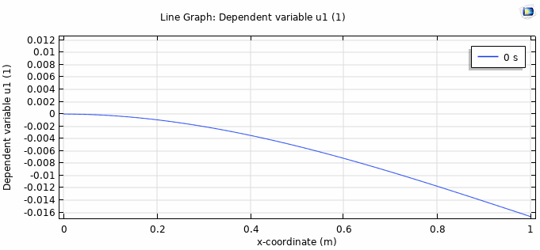

# Projects

* * *

## Master Thesis

**Title: Development of a Spectral Element Method for simlation of water waves using Incompressible Navier-Stokes Equations**

This project concerns developing of a Spectral Element Method for simulation of water waves using the Incompressible Navier-Stokes Equations. The method will be developed in a general Runge-Kutta setting, which allows for high-order time-stepping, high order spatial convergence and geometric flexibility. 

As an intermediate result a [poster](./NSE_Poster_linear.html) on the work for the linearised model was presented for the DTU 02689 class. 

* * *

## Bachelor Thesis

**Title: Oscillation modes of an offshore wind turbine monopile**

This project concerned the investigation of the dynamics of an offshore wind turbine monoopile. 

Below is shown a partially damped monopile. 

* * *

Stay tuned for more projects.

[back](./)
